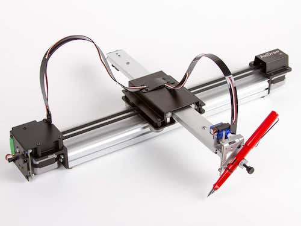
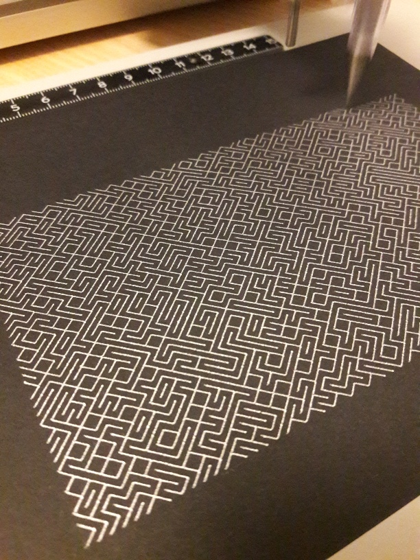

C'est une rencontre que nous voulions faire depuis longtemps. L'[Axidraw](https://www.axidraw.com/), le petit robot à dessiner, est l'exemple parfait de l'outil simple mais bourré de potentiel créatif.

Que fait-il ? Il dessine, vraiment, en maniant avec dextérité tout crayon, stylo, feutre, pinceau que vous voudrez bien lui confier.

Il faut le guider, bien entendu, il n'invente rien. Et pour ça vous avez le choix : sans une seule ligne de code, grâce à une extension [Inkscape](https://inkscape.org/fr/) (le génial logiciel libre de dessin vectoriel), ou avec toute la souplesse des [nombreuses API et interfaces](https://wiki.evilmadscientist.com/AxiDraw#For_Developers) disponibles.

C'est un compagnon idéal pour des logiciels de programmation créative et d'art génératif comme [Processing](https://processing.org/) (nous en reparlerons).

Voilà donc un outil qui ouvre de nombreuses perspectives de projets à la frontière des sciences et de la création artistique.

Une autre caractéristique de ce robot, c'est la qualité de sa conception qui fait appel à plusieurs pièces sur mesure. Si c'est un vrai plaisir de l'utiliser, ça ne facilite pas sa réplication "à la maison".  
Au vu de son prix pourtant (aux alentours de 500€ pour le modèle A4), on pourra être tenté d'en créer sa propre version.

Mais peut-on rivaliser avec les prototypeurs californiens fous d'_Evil Mad Scientist_ (EMS) ?

Ni une ni deux, la R&D d'Incaya se met au travail. L'objectif ? Concevoir un _Incadraw_ à partir de matériel standard, facile à trouver (en France ou depuis la France), et le moins coûteux possible.  
Et également, déterminer à quel point les astuces de contruction d'EMS font la différence...

On notera qu'il existe déjà quantité de clones : des modèles à bas coût dans les boutiques en ligne de l'empire du Milieu, ou d'ingénieux _plotters_ (traçeurs) proposés par les makers du monde entier.  
Nous réinventerons donc la roue, c'est assumé, mais en cherchant à comprendre et à documenter les subtilités d'un tel outil.

**Dans l'épisode suivant** : [comment ça marche, un Axidraw ?](https://www.incaya.fr/blog/axidraw-2)
