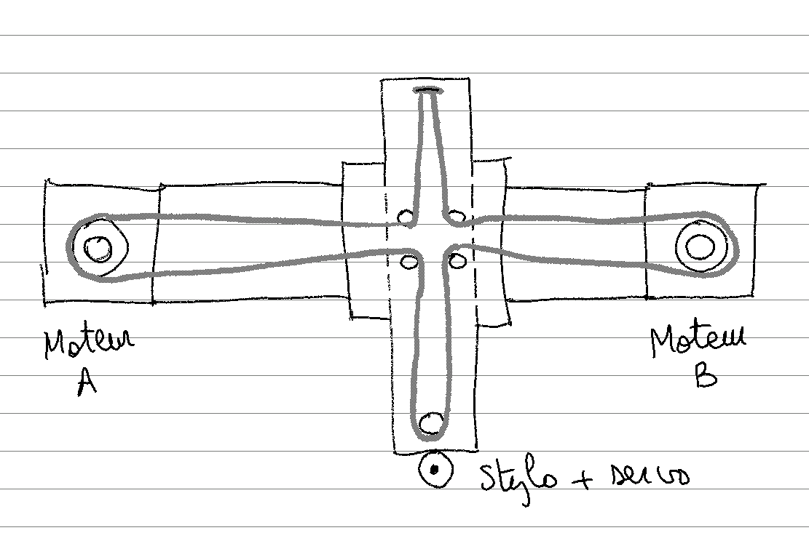
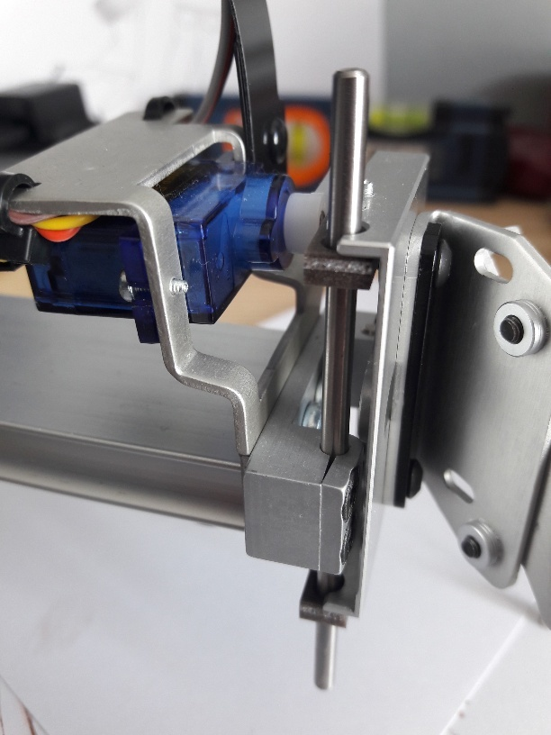

L'Axidraw dessine, c'est acté, mais comment fonctionne-t-il ? C'est un mélange d'extrême simplicité (du point de vue du roboticien) et d'astuces qui font la différence.

Allons à l'essentiel. Nous parlons d'une petite machine à commande numérique ([CNC](https://fr.wikipedia.org/wiki/Machine-outil_%C3%A0_commande_num%C3%A9rique)), à deux axes principaux (X et Y), avec un pseudo troisème axe (Z) qui est pris en charge par un servomoteur de modélisme.

Les déplacements principaux X et Y sont réalisés en commandant deux moteurs pas à pas fixés face-à-face sur un profilé aluminium. Ce dernier sert de support à l'axe X, mais assure également la stabilité de l'ensemble. En résumé, il doit être lourd.

Les déplacements en Y sont permis par un deuxième profilé, plus léger, à l'extrémité duquel est fixé le servoteur qui permet de monter ou de descendre l'outil (stylo, crayon, pinceau).

Dans de nombreux modèles de CNC 2 axes, chaque moteur prend en charge un axe. Ici c'est différent : grâce à **un astucieux système de poulies** (quatre au centre et une à l'extrémité du profilé Y, la courroie étant fixée à l'autre extrémité), c'est la synchronisation du mouvement des moteurs qui permet de positionner l'outil.

A titre d'exemple, si les deux moteurs tournent en sens inverse, vers l'extérieur, X reste fixe mais Y est en mouvement : le stylo se déplace vers l'utilisateur.

C'est un montage certainement moins robuste, qu'on ne conseillerait pas pour du fraisage, par exemple. Mais dans le cadre de cet utilisation en "plotter", il permet un mouvement fluide parfaitement adapté à la manipulation (reproductible) d'un dispositif de marquage léger et parfois fragile.

_C'est en tous cas notre hypothèse ! Nous verrons ensuite si elle se vérifie avec l'Incadraw._

Un mot sur les profilés : ils sont usinés spécifiquement pour cette machine. Il sera _a priori_ impossible de les trouver chez le marchand. Ils constituent -avec les roues également "custom"- un système de guidage linéaire très bien conçu qu'il ne sera pas évident d'égaler.

Ensuite, l'Axidraw est doté d'**une carte à microcontrôleur sur mesure**: [l'EiBotBoard](http://www.schmalzhaus.com/EBB/) (EBB), conçue par Brian Schmalz. Celle-ci est dédiée à un usage précis : **permettre à un ordinateur de contrôler deux moteurs pas-à-pas au travers d'une connexion USB**. Contrairement à d'autres cartes qui manipulent le G-code grâce à un firmware tel que [Marlin](https://marlinfw.org/), l'EBB dispose de son propre firmware et de son jeu de commandes associé. La principale (SM) permet de déplacer le robot entre deux points d'un plan, en ligne droite.  
_C'est via ces commandes que l'extension Inkscape traduit des vecteurs en déplacements d'Axidraw_.

Le désavantage de cette approche est qu'elle oblige à utiliser un matériel spécifique, et pas une carte traditionnellement utilisée dans l'impression 3D, par exemple.  
Par contre, elle est particulièrement adaptée à cet usage, et elle est open source / open hardware : on peut théoriquement la fabriquer soit-même.  
Le plan B pour un robot _home made_ ? Se la procurer pour 50 dollars [chez EMS](https://shop.evilmadscientist.com/partsmenu/188-ebb) !

Parlons enfin du servomoteur : c'est un modèle plastique à 5€, à qui on ne demande pas d'effort particulier (sinon de fonctionner correctement).  
L'astuce est là aussi dans l'usinage. Les tiges d'aluminium qui permettent le mouvement "en Z" sont guidées au travers d'une petite lamelle de matériau "anti friction", qui fait la différence quand le robot doit réaliser des mouvements répétitifs et rapides.

Figure 2 : le servomoteur et son guide

En le réglant correctement, on obtient un "tombé" parfait, rapide et très peu freiné. Utile quand on parle de _millisecondes_ de transition entre les déplacements.

Après ce tour d'horizon, nous débutons le prototypage de l'Incadraw par l'un des éléments clés : le plateau central ("plateau de portique" ou "gantry plate").
