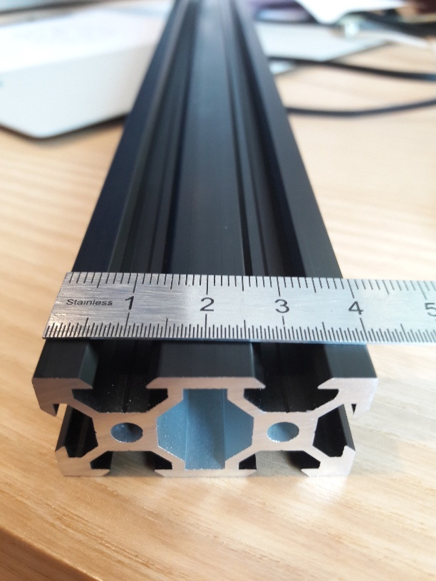
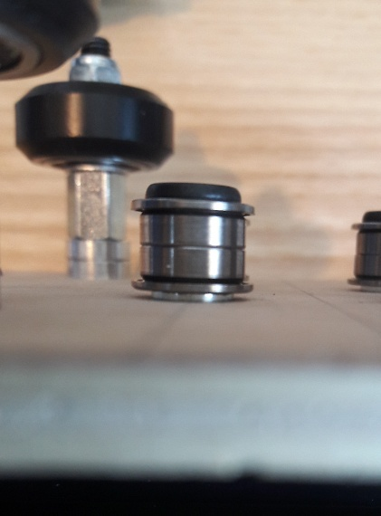
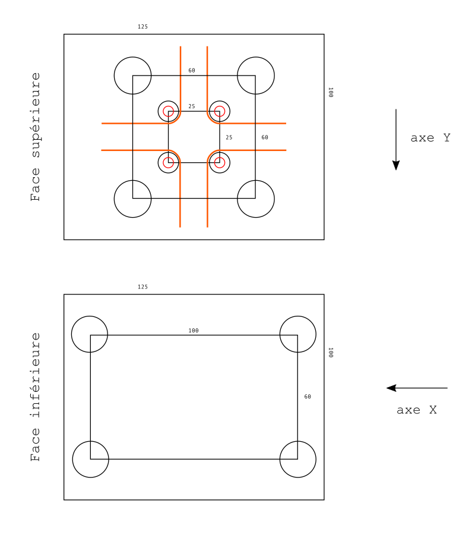
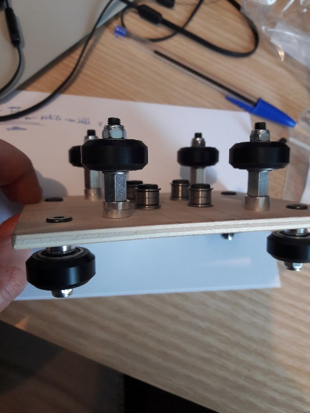

Dans notre quête d'une version maison de l'Axidraw, nous débutons par un élément crucial, qui permet à l'ensemble de fonctionner.<!--more-->

## Notre matériel de référence

Il s'agit de la gamme V-Slot fabriquée par [OpenBuilds](https://openbuildspartstore.com/) (US). Nous l'achetons chez [PC-CNC](https://pccnc-shop.fr/) (FR) ou chez [Systéal](https://www.systeal.com/) (FR).

Cette gamme a l'avantage d'être robuste, largement utilisée y compris en France, et disponible sans délai majeur chez plusieurs fournisseurs.

Cela signifie que dès que c'est possible, nous utilisons ce matériel. Dès qu'il n'est plus adapté, nous choisissons d'autres pièces, ou nous concevons des pièces sur mesure (c'est le cas ici).

Le plateau central a plusieurs rôles :

-   se déplacer en X le long du profilé principal ;
-   se déplacer en Y le long du profilé secondaire ;
-   relier les deux moteurs via la courroie et les quatre poulies centrales (voir l'épisode précédent).

Pour y parvenir on doit y fixer :

-   en dessous, 4 roues pour s'appuyer sur le profilé principal
-   au dessus, les 4 poulies et les 4 roues qui permettent au profilé secondaire de coulisser

La principale difficulté est de **gérer l'encombrement** : les poulies doivent être suffisamment basses pour passer sous le profilé supérieur, et les roues pas trop hautes, au risque de ne plus être compatibles avec la trajectoire de la courroie.

Le [plateau V-Slot #621](https://openbuildspartstore.com/v-slot-gantry-plate-universal/) s'est révélé trop petit et inadapté pour accueillir tous ces éléments.  
**Nous nous sommes résolus à concevoir un plateau sur mesure**.

En attendant d'avoir accès à une découpe laser et à des matériaux plus résistants, nous avons utilisé du contreplaqué japonais, particulièrement agréable à usiner à la main (scie sauteuse, gouge, Dremel).  
Le résultat est suffisant ; le seul soucis est l'épaisseur (5mm) qui devra être moins importante (plutôt 3mm) dans la version finale.

L'emplacement des roues V-Slot (écartées de 60mm) est déterminé par la largeur des profilés (40mm). Les deux axes sont évidemment perpendiculaires.

Trouver les poulies adaptées (de très petite taille) s'est révélé plus épineux. Les [poulies V-Slot #550](https://openbuildspartstore.com/smooth-idler-pulley-kit/) sont trop grosses pour la partie centrale, cette piste a donc été écartée rapidement.

La solution était ailleurs : en scrutant l'Axidraw, nous avons découvert qu'il s'agissait en fait de roulements à billes "à collerette" assemblés deux par deux. Référence à chercher : Roulement à billes "avec flasque", "à collerette" ou "à bride", 5x10x4mm type MF105ZZ, dénichés chez [Bohrer](https://www.bohrer-onlineshop.de/) (DE) ou sur [Banggood](https://www.banggood.com/) (CN).  
Il en faudra 8, donc.

En appui sur une petite rondelle, les roulements font parfaitement le travail.

Pour pallier l'épaisseur trop importante du plateau, nous utilisons des écrous "[Tee nuts M5](https://openbuildspartstore.com/tee-nuts-m5-10-pack/)" en face inférieure, en fraisant légèrement le bois pour insérer leur pas de vis dans l'épaisseur.

Figure 3 : schéma de la plaque centrale

Les roues du dessous sont assemblées en V-Slot traditionnel : vis M5 de 25mm, entretoise de 6mm, rondelle, [kit roue en Delrin #495](https://openbuildspartstore.com/delrin-mini-v-wheel-kit/) et écrou bloquant M5.

Les roues du dessus nécessitent un autre montage pour être suffisamment surélevées : vis M5 de 40mm, entretoise de 6mm, entretoise de 10mm, rondelle, kit roue et écrou bloquant.

N.B. : dans cette première configuration nous n'utilisons pas d'[entretoises excentriques](https://openbuildspartstore.com/eccentric-spacer/) (6mm d'épaisseur) qui permettraient pourtant de régler le serrage des roues. Nous conservons donc à chaque fois des entretoises classiques de 6mm, qu'il sera facile de remplacer plus tard sans modifier les cotes.
