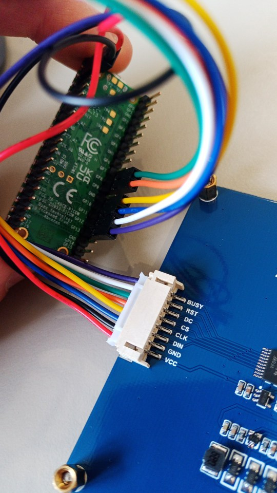
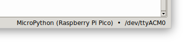
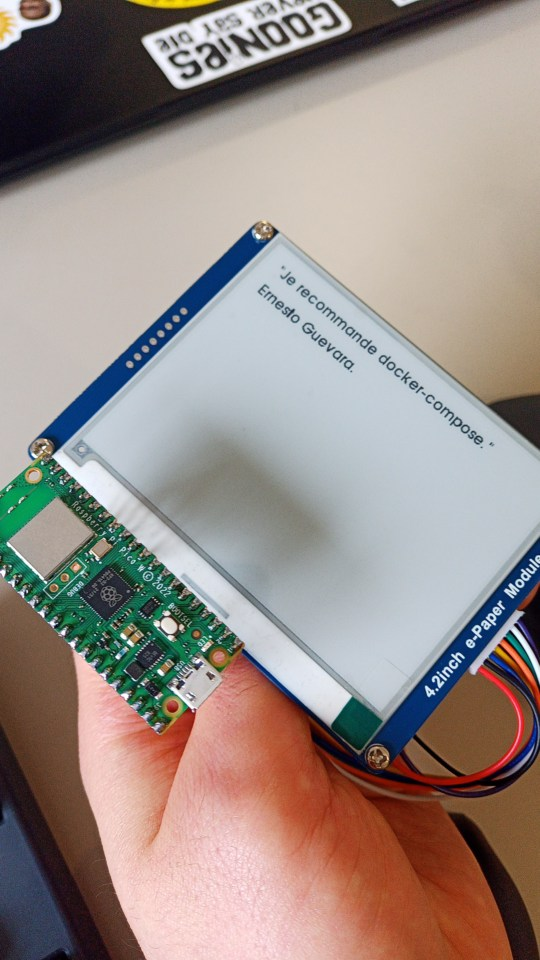

## Un besoin classique, une nouvelle plateforme

Afficher des données issues d'une API est un besoin très courant, et il existe de nombreuses plateformes déjà disponibles pour le faire. Le Raspberry Pico W nous propose une nouvelle approche, avec la possibilité d'une programmation en [micropython](https://micropython.org/) qui introduit une certaine convivialité (même si elle pourra déstabiliser les habitué·es du C et d'Arduino).

Ce Pico connecté est construit autour de [la puce RP2040](https://www.minimachines.net/actu/raspberry-pi-rp2040-99911), désormais bien connue, à laquelle on a associé un circuit Wi-Fi 2.4 GHz (Infineon CYW43439).

Nous ajoutons ici un module d'écran ePaper de 4.2 pouces, 400x300 pixels ([Waveshare](https://www.waveshare.com/wiki/4.2inch_e-Paper_Module)) qu'il s'agira de piloter pour profiter de sa persistence et de sa lisibilité légendaire. A nous le monitoring de serveurs, la météo ou les horaires de bus en direct !

## Les enjeux

A quel point le Raspberry Pico W est une plateforme crédible pour les besoins habituels de l'IoT Wi-Fi ? Voici l'occasion d'un premier test.

A l'heure où apparaissent des modules eink/pico "plug an play" ([celui-ci par exemple](https://thepihut.com/products/3-7-e-paper-e-ink-display-for-raspberry-pi-pico-480x280)), il semblait également intéressant de savoir connecter des modules ePaper assez polyvalents (vous savez : celui qui dort depuis trop longtemps dans un tiroir !).

## Connecter notre écran

Doté d'une interface SPI, notre module écran ePaper nous propose 7 connecteurs femelles, bien pratiques pour le relier à notre Pico W.

**[écran => Pico]**

```
- BUSY : GP13
- RST : GP12
- DC : GP8
- CS : GP9
- CLK : GP10
- DIN : GP11
- GND : GND
- VCC : VSYS
```



## Le code

Nous programmons ici en Micropython avec [Thonny](https://thonny.org/), qui facilite bien nos tests.

Pensez à sélectionner l'interpréteur pour Rapsberry Pico :



Le code source est disponible sur [le dépôt Github du projet](https://github.com/incaya/inkpicow-web).


### A quoi servent les différents fichiers ?

`texgyread20.py` et `texgyread30.py` définissent les fontes utilisées pour afficher notre texte.

`epaper.py` est le driver qui nous permet de piloter l'écran ePaper.

`main.py` est le programme principal qui comprend :

- l'initialisation de l'objet écran (EPD) et de son *buffer* (*buf*), ainsi que la fonction `writetext` qui l'exploite.
- la phase de connexion au Wifi : **pensez à personnaliser votre SSID/Mot de passe**.
- un exemple de requête HTTP, et d'affichage d'une donnée.

Notez bien que la manipulation de l'écran passe par un buffer. Il y a donc deux étapes : 1️⃣ modifier le buffer, puis 2️⃣ rafraîchir l'écran.

## Références

Merci au projet [einkpicocalendar](https://github.com/resetreboot/einkpicocalendar) pour son partage bien utile.

--- 

