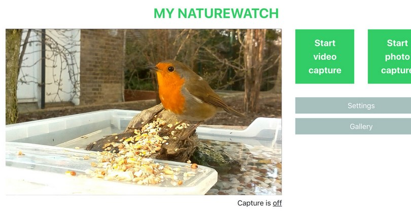
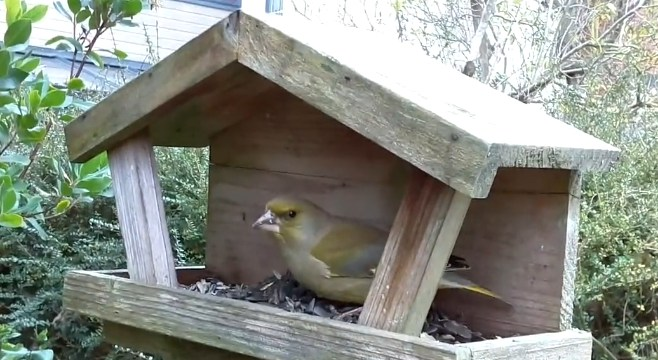

## Un piège photographique bon marché et accessible

Voilà des mois (des années ?) que nous devions vous en parler, mais ce projet est un tel fil rouge pour INCAYA que nous avons sans cesse repoussé le moment du bilan.

Il faut d'abord dire que notre **FauneCam** est un outil très largement inspiré de [MyNatureWatch](https://mynaturewatch.net/), un formidable projet initié par d'ingénieux londoniens. Nous les remercions pour leur travail et surtout pour leur choix d'en faire un commun numérique et technique, par le partage d'expérience et de [code source](https://github.com/interactionresearchstudio/NaturewatchCameraServer).

Persuadés de l'intérêt de cette petite caméra "low cost", nous avons décidé de la constuire pour nous et de rédiger [un tutoriel en français](FauneCam_ModeEmploi_nov2021.pdf). Puis à partir de juin 2021, un partenariat s’est construit entre INCAYA, le [CPIE Vallée de l’Orne](https://www.cpievdo.fr/) et [le Dôme](https://ledome.info) : la caméra connectée a été proposée et améliorée avec le public du [Turfu Festival](https://turfu-festival.fr/) 2021 et de la Nuit de l’Imagination 2022.

C’est désormais un outil utilisé par le CPIE pour élaborer des activités locales d’éducation à l’environnement, notamment à destination du public scolaire.

Nous vous laissons découvrir le [tutoriel de construction](FauneCam_ModeEmploi_nov2021.pdf), mais voici la recette du succès :

- un [Raspberry Pi Zero W](https://www.raspberrypi.com/products/raspberry-pi-zero-w/) doté d'un petit serveur web capable de déclencher une prise de vue lorsque l'image change significativement ;
- sa [caméra miniature](https://www.gotronic.fr/art-module-camera-5-mpx-camerazero-31516.htm) qui permet de prendre les photos ou les vidéos ;
- une batterie pour mobile ("powerbank") qui alimente le petit ordinateur monocarte pendant plusieurs heures.

Le point d'accès WiFi offre la possibilité d'accéder à une interface utilisateur simple mais suffisante, dans votre navigateur favori.

Quel plaisir d'espionner le rouge-gorge, tranquillement installé-e dans son fauteuil ! 🤩

## Des perspectives à foison

Avec un tel outil, il est assez facile d'imaginer de nouvelles utilisations.

- Nous planchons sur un projet de **caméra nocture**, avec une caméra infrarouge et un éclairage _ad hoc_. A nous les hérissons, les mulots et les chats du quartier !
- En partant de cette même base technique, nous avons réalisé une preuve de concept de caméra capable de **"reconnaître" les papillons de nuit grâce au _deep learning_**. 

Ce dernier point est un sujet à part entière ! Nous y reviendrons très prochainement.

--- 

