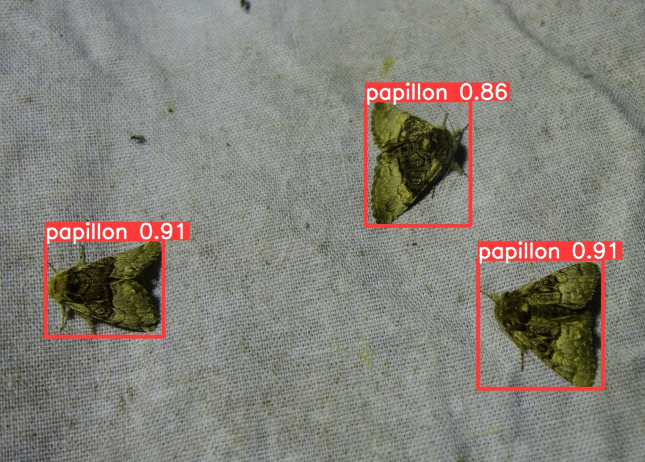

## Rappel du contexte

Nous avons depuis plusieurs années un projet "fil rouge" qui mêle numérique et biodiversité : [la FauneCam](https://incaya.fr/blog/camera-open-source-pour-observer-la-faune/).

Cette caméra facile à fabriquer est un outil précieux pour mettre en place des projets de sciences participatives, et c'est un vrai succès grâce à nos partenaires historiques : le [Dôme](https://ledome.info) et le [CPIE Vallée de l'Orne](https://www.cpievdo.fr/).

Nous souhaitions dès lors aller plus loin, et lui ajouter de nouvelles capacités. Nous avons donc répondu à l'appel à projet "[Booster IA](https://www.normandie.fr/appel-projets-booster-ia-edition-2023)" lancé par la Région Normandie et nous avons proposé de prolonger ces partenariats en prototypant une solution d’edge computing («informatique en périphérie»), basée sur le machine learning embarqué. 

Notre preuve de concept avait donc pour objectif le développement d’un programme d’intelligence artificielle hébergé sur un ordinateur monocarte. Nous cherchions à mettre en œuvre des technologies qui pourraient à l’avenir s’adapter à des problématiques diverses, mais ce prototype s’est concentré sur l’identification des papillons de nuit (hétérocères).

## Partenariats

Nous tenions à souligner la qualité des partenariats qui se sont mis en place à l’occasion de ce projet.
L’appui du Dôme nous a été précieux tout au long du processus de prototypage, ainsi que dans le cadre du Turfu Festival 2023 qui nous a permis de faire connaître la preuve de concept et de la présenter à un public nombreux dont les apports ont été riches et inspirants.

L’intervention du CPIE Vallée de l’Orne a permis de clarifier les enjeux en termes de collecte de données de biodiversité et de définir des objectifs de long terme pour les sciences participatives. La préparation et la co-animation des trois ateliers du [Turfu Festival](https://turfu-festival.fr/) ont également été très appréciées.

Nous avons également eu la chance de bénéficier de l’expertise du [GRETIA](http://www.gretia.org/) (Groupe d'ETude des Invertébrés Armoricains) sur les hétérocères (papillons de nuit), et nous avons à plusieurs reprises pu confronter nos objectifs initiaux et la réalité de la collecte de données de terrain, ce qui a permis de questionner et de réorienter judicieusement les choix techniques. Les bénévoles ont également été d’une grande aide dans la conception du prototype de terrain.

## Retour d'expérience

Edge Data Cam s’est révélé être un projet très complet sur le plan technique. La preuve de concept a nécessité la mise en œuvre de savoir-faire diversifiés dans un temps assez court.

Nous avons pu atteindre les objectifs fixés et développer :

- un dispositif physique (prototype bois et aluminium) qui a servi de support à des tests de terrain et à partir duquel nous avons pu imaginer des évolutions, avec des experts comme avec le public du Turfu Festival 2023 ;
- un piège photographique basé sur une carte Raspberry Pi, une caméra, un dispositif d’éclairage contrôlé par un circuit électronique développé pour l’occasion ;
- un modèle de deep learning basé sur [PyTorch](https://pytorch.org/) et [YOLOv5](https://github.com/ultralytics/yolov5) ;
- un logiciel dédié qui permet à l’utilisateur de contrôler la prise de vue (time lapse) depuis un mobile ou un ordinateur, d’en collecter les images et de mettre à profit le modèle de deep leaning pour élaborer des inférences à la volée grâce à [OpenCV](https://opencv.org/).

Certains aspects du développement se sont révélés particulièrement complexes et ont nécessité de nombreux tests.
Il s’agit notamment de la collecte de données dans un domaine où elles sont rares. Les collections du GRETIA ont, de ce point de vue, été d’un grand secours pour initier le dispositif et prendre le relais des Google Open Images qui présentaient un intérêt qualitatif limité.

Le choix du framework de deep learning pour l’entraînement du modèle a fait l’objet d’une analyse poussée. 

S’agissant en première intention de détecter des éléments potentiellement nombreux au sein d’une même image, l’utilisation de l’algorithme You Only Look Once (YOLOv5) a donné des résultats prometteurs et a donc été intégré dans la pile technique.

Enfin, dans le cadre de nos travaux et des ateliers, nous avons tiré parti de l’application Label Studio pour annoter nos images et préparer l’entraînement du modèle.

De façon générale, les échanges avec les participant·es du [Turfu Festival](https://turfu-festival.fr/) ont été riches de suggestions et de pistes d’amélioration, grâce à des profils très variés et complémentaires :

- le naturaliste, qui précise les contraintes de terrain et les attentes du métier  ;
- le grand public, qui s’interroge sur l’utilisation de l’IA, ses promesses et ses limites ;
- le développeur, ou l’ingénieur, qui apporte de nouvelles pistes techniques.

## Perspectives

Sur le plan technique, cette preuve de concept nous a fourni l’expérience nécessaire pour envisager de nouveaux projets dans le prolongement de l’expérience Edge Data Cam. Elle nous a également procuré de nombreuses clés d’analyse pour évaluer l’impact, les exigences et la pertinence du deep learning (et de l’intelligence artificielle en général) dans de nouveaux contextes.

Pour conclure, nous sommes très enthousiastes à l’idée de continuer à faire vivre ces partenariats régionaux. Ils contribuent à la production et à la diffusion des connaissances scientifiques, essentielles à l’évaluation objective de l’impact des activités humaines sur la biodiversité, et précieuses pour repenser notre relation au vivant.

_Edge Data Cam a été soutenu financièrement par la [Région Normandie](https://www.normandie.fr/) dans le cadre dispositif "Booster IA 2022"_

