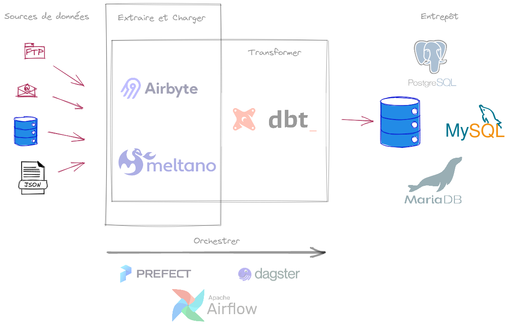
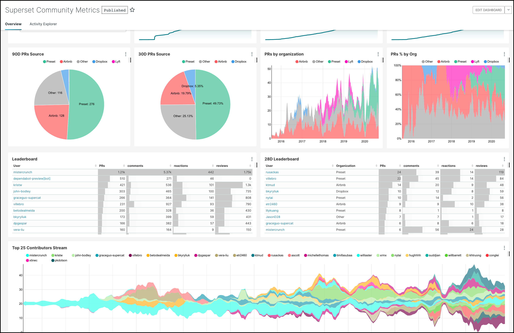

Quand on maîtrise l'art de la débrouille avec les feuilles de calcul à coups de formules magiques, on peut faire parler les données d'un export brut et obtenir des résultats satisfaisants pour suivre son activité ou "produire des statistiques".

Cette méthode pragmatique, éprouvée et souvent efficace, s'avère néanmoins fragile dans le temps avec une maintenance qui peut devenir lourde et une évolutivité limitée voir coûteuse.

L'offre logicielle pour professionnaliser ces traitements est pléthorique. Bien que ces logiciels apprtiennent souvent au monde du [logiciel propriétaire](https://fr.wikipedia.org/wiki/Logiciel_propri%C3%A9taire), l'offre [libre et open source](https://fr.wikipedia.org/wiki/Free/Libre_Open_Source_Software) gagne indéniablement du terrain. C'est en tout cas le pari que nous faisons chez Incaya ...

## Un peu de jargon

Pour beaucoup de besoins courants, inutile de convoquer big data, machine learning ou intelligence artificielle. Il suffit de prendre l'exemple de plusieurs sources de données hétérogènes à assembler proprement par l'intermédiaire de transformations plus ou moins nombreuses et complexes.

Quelque soit le domaine d'exploration, les données peuvent provenir :
- de fichiers (CSV, JSON, XML, ...)
- de bases de données - parfois exotiques - alimentées par des systèmes de gestion divers
- d'[API](https://fr.wikipedia.org/wiki/Interface_de_programmation)
- etc ...

Qu'on veuille faire de la [data visualisation](https://fr.wikipedia.org/wiki/Visualisation_de_donn%C3%A9es) ou servir une API de manière propre et structurée, il faut avant toutes choses consolider toutes ces données à disposition, les transformer et les nettoyer pour en faciliter l'exploitation.

Ces techniques sont résumées dans les acronymes [ETL](https://fr.wikipedia.org/wiki/Extract-transform-load) ou [ELT](https://fr.wikipedia.org/wiki/Extract_load_transform) dans le but de construire un [entrepôt de données](https://fr.wikipedia.org/wiki/Entrep%C3%B4t_de_donn%C3%A9es).

Parfois, quand la quantité d'étapes de transformation, et leur complexe imbrication, le justifie, on peut avoir recours à un orchestrateur de données ou gestionnaire de [dataflow](https://fr.wikipedia.org/wiki/Architecture_Dataflow).

L'open source et le libre répondent par une large [galaxie d'outils](data-opensource-galaxy.png) (liste non exhaustive incluant des logiciels propriétaires).

C'est dans le domaine de la [BI](https://fr.wikipedia.org/wiki/Informatique_d%C3%A9cisionnelle) que cet outillage est systématiquement utilisé, néanmoins il nous semble que le monde du développement web gagnerait à s'en emparer notamment pour étendre des architectures [CQRS](https://fr.wikipedia.org/wiki/S%C3%A9paration_commande-requ%C3%AAte).

> Résumé : on prend des données difficilement exploitables et on les stocke en un lieu unique dans un format lisible et exportable, à l'aide de tâches automatisées intégrées au système d'information

## Une pile open source souple et performante

Cette offre open-source abondante permet d'envisager des architectures des plus lourdes aux plus légères pour ce qui concerne le traitement des données. 

Les enjeux, en clair, sont :
- être en mesure d'importer des données dans des formats hétérogènes sans alourdir la pile logicielle
- donner aux développeurs la capacité à produire vite dans un environnement maîtrisé
- limiter l'effort de maintenance en utilisant des outils légers et stables

Chez Incaya, nous apprécions tout particulièrement un outil comme [DBT](https://www.getdbt.com/) qui répond parfaitement à ces objectifs tant il s'appuie sur des standards et un minimum d'abstraction (seule la maîtrise de [SQL](https://fr.wikipedia.org/wiki/Structured_Query_Language) compte). Par ailleurs, nous suivons avec attention le projet [Airbyte](https://airbyte.com/) qui s'avère très efficace pour le chargement des données depuis un grand nombre de [types de source](https://airbyte.com/connectors).

Pour le stockage des données de l'entrepôt, nous utilisons - sauf contre ordre du client - [PostgreSQL](https://www.postgresql.org/) qui nous semble le [SGBD](https://fr.wikipedia.org/wiki/Syst%C3%A8me_de_gestion_de_base_de_donn%C3%A9es) open source le plus complet à ce jour.

> Résumé : l'association ELT *Airbyte-DBT-PostgreSQL* a de l'avenir, en témoigne le nombre grandissant d'articles qui en font la promotion sur le oueb

## La visualisation de données pour toutes et tous

Habitué par le passé aux outils propriétaires forcément (quoique) bien conçus, j'étais souvent déçu par l'offre open-source de visualisation de données (je parle d'un temps ... bref avant 2015, en gros). Il y manquait toujours l'une ou l'autre de ces fonctionnalités souvent très attendues :
- accéder aux données à restituer sans contrainte
- fournir aux utilisatrices et utilisateurs un accès personnalisé, tou.te.s n'ayant pas les mêmes besoins, entre simplement utiliser les tableaux de bord et pouvoir en concevoir
- disposer d'un catalogue de types de visualisation suffisant pour couvrir les besoins d'analyse

Notons que tous les outils de dataviz open source ne disposent pas d'une version communautaire complète. Il n'est pas rare qu'il faille souscrire à une offre payante dans le cloud (ou pas) pour disposer de l'ensemble des fonctionnalités attendues. Néanmoins, pour celles et ceux n'ayant pas l'intention d'installer et héberger l'outil par leurs propres moyens, il est souvent pratique que les animateurs de la communauté aient prévu une offre cloud.

Justement, pour avoir le libre choix entre une intallation propre et du cloud, sans perte de fonctionnalité, et bien que ce ne soit pas la seule solution, nous avons été séduit par le projet [Superset](https://superset.apache.org/) porté par la puissante communauté [Apache](https://projects.apache.org/). Notons que les visualisations à disposition reposent notamment sur la très robuste librairie [D3.js](https://d3js.org/) que l'on peut même utiliser seule pour intégrer des indicateurs dans un [site ou une application web (webapp)](https://dev.to/lawalalao/quelle-est-la-difference-entre-un-site-web-et-une-application-web-2ml1).

PS: pour l'offre cloud, voir chez [Preset](https://preset.io/product/) qui se trouve être l'initiateur du projet Superset avant l'incubation chez Apache.

*Image piochée [ici](https://developer.ascend.io/docs/superset)*

A noter qu'une solution de visualisation de données se choisit selon plusieurs critères :
- la solution doit-elle s'intégrer à une application existante ?
- y-a-t-il une large gamme de types d'utilisation à prévoir au sein de l'organisation ? de l'utilisateur "consommateur" à l'analyste qui doit être capable de créer ses propres visualisations au travers de la solution ?
- la production, voir l'envoi automatisé, de rapports préformatés est-il nécessaire ?
- etc ...

L'offre est suffisamment étoffée pour qu'il soit possible de trouver la ou les solutions idoines, y compris en focalisant sur l'open source.

> Résumé : il n'existe pas de solution open source de visualisation de données "qui fait tout même le café" - et c'est surement une bonne chose. Cependant, Apache Superset nous semble LE projet à suivre qui se focalise sur l'essentiel pour répondre à un très grand nombre de besoins

## Le libre et l'open source résistent très bien face aux logiciels propriétaires

Le libre et l'open source s'imposent lorsqu'on est soucieux de pouvoir fournir des tableaux de bord au plus grand nombre, notamment dans des domaines d'activité où les budgets sont réduits - de la plus petite association ou collectivité à la PME oeuvrant dans [l'ESS](https://fr.wikipedia.org/wiki/%C3%89conomie_sociale_et_solidaire) par exemple.

Par ailleurs, il n'est pas rare de rencontrer des projets où la visualisation de données se trouve être "la cerise sur le gâteau", par exemple quand il s'agit de fournir de simples indicateurs dans une application web de collecte de données de [sciences participatives](https://fr.wikipedia.org/wiki/Sciences_participatives) grand public. La robustesse des solutions apportées par l'open source dans ce cas n'est plus à démontrer.

De plus, un projet open source avec une communauté bien portante et gérée génère des évolutions produit régulières au plus près des remontées utilisateurs ainsi que de la documentation en continu. Le lien direct entre utilisateurs et développeurs de la communauté permet cette agilité, à fortiori quand les utilisateurs se trouvent eux-mêmes être membres de cette communauté de développeurs.

Chez Incaya, nous essayons autant que possible de contribuer en apportant nos retours d'expérience ou quelques lignes de codes.
